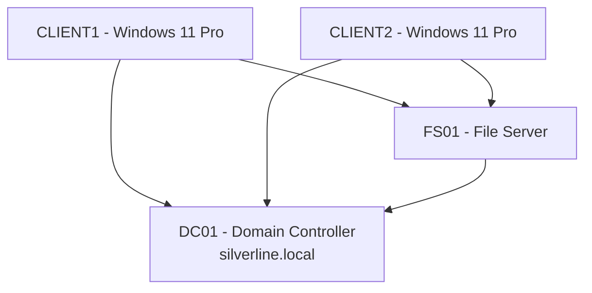

# Silverline Technologies Active Directory Lab

This repository documents a complete **Active Directory lab environment** for a fictional company, **Silverline Technologies**.  
The lab simulates a small enterprise setup with a domain controller, file server, and Windows clients.  

It demonstrates skills in **Active Directory, DNS, Group Policy, File Services, and IT troubleshooting** — all key areas for IT Support, Helpdesk, and System Administrator roles.

---

## 🔷 Lab Environment

- **Domain Controller (DC01)**  
  Active Directory Domain Services (AD DS), DNS  
  Domain: `silverline.local`

  Shared folders and departmental shares with NTFS + Shar
- **File Server (FS01)**  e permissions

- **Clients (CLIENT1, CLIENT2)**  
  Windows 10/11 workstations, joined to the domain

- **Networking**  
  VirtualBox Host-Only network: `10.0.25.0/24`  
  Static IPs assigned to each VM  
  Clients point DNS to DC01 (10.0.25.10)

- **Host PC Specs**  
  - Intel 10-core / 16-thread CPU  
  - 48 GB DDR4 RAM  
  - 2 TB HDD (VM storage)  
  - Windows 11 Pro host  
  - Oracle VirtualBox  

---

## 🔷 Project Phases

### Phase 1 — Active Directory + DNS Setup
- Promoted DC01 as domain controller
- Created `silverline.local` domain + DNS zones
- Verified name resolution and connectivity

### Phase 2 — File Server Setup
- Configured FS01 with shared folders:
  - `\\FS01\Shared` (all users)
  - Departmental shares: HR, IT, Finance
- Applied NTFS + Share permissions
- Tested access and “Access Denied” scenarios

### Phase 3 — OUs, Users, Groups, and Group Policies
- Created OUs for HR, IT, Finance, Users, and Computers
- Added users manually and via bulk script
- Created security groups and assigned users
- Applied Group Policies:
  - Password policy (length, complexity, lockout)
  - Login banner
  - Drive mappings (Z: shared drive, H:/I:/F: for departments)
- Tested with domain users on CLIENT1 and CLIENT2

---

## 🔷 Key Skills Demonstrated
- Active Directory design and management
- DNS configuration and troubleshooting
- File server permissions (NTFS vs Share)
- Group Policy Objects (GPOs) for security and automation
- Bulk user creation with PowerShell
- Common IT troubleshooting workflows (DNS issues, permissions, password resets)

---

## 📊 Network Diagram

---

## 📸 Screenshots
Screenshots of setup and testing are stored in [`/docs/screenshots`](docs/screenshots):
- Domain Controller setup
- OU structure in ADUC
- File share permissions
- Client domain join
- GPOs applied on clients

---

## ⚡ Automation
- PowerShell scripts in [`/scripts`](scripts) demonstrate automation:
  - Bulk user creation
  - Network drive mapping
  - Resetting passwords

---

## 📝 Case Studies
Example IT support tickets for Silverline Technologies are documented in [`/cases`](cases):
- [Resetting a Forgotten Password](cases/password_reset.md)
- [Troubleshooting Access Denied](cases/access_denied.md)
- [Applying Group Policies](cases/apply_gpo.md)

